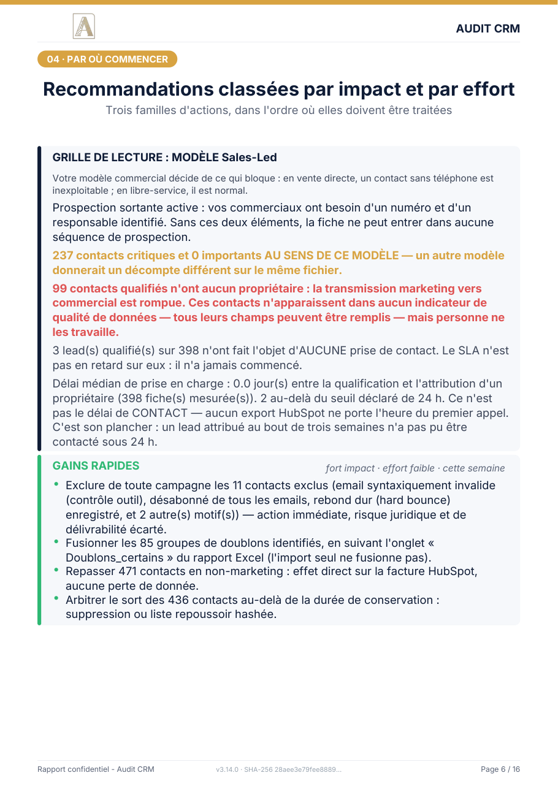
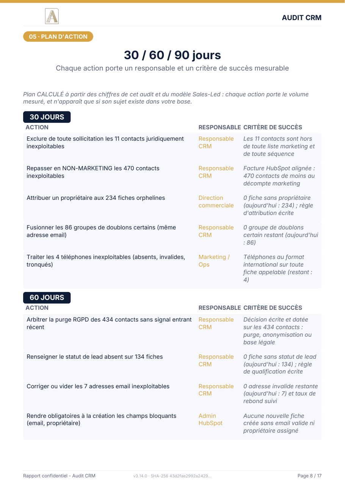

# Inspectable CRM audit sample

*[Lire en français](README.md)*

This repository holds **a complete CRM audit report**, exactly as it is delivered, together with
the files that come with it. Nothing is staged: these are the tool's real outputs from an ordinary
run.

It exists for a simple reason. An audit is judged on what it produces, not on how it is described.

---

## The report

**17 pages, ten sections.** The cover carries the whole diagnosis, because a report that takes
twelve pages to state the problem will not be read.

On this sample, the tool analyses 853 contacts and concludes:

| | |
|---|---|
| Overall score | **72.4 / 100**, needs watching |
| Genuinely prospectable base | **73 contacts out of 853** (8.6 %), of which 71 survive cleaning |
| Legally unusable as they stand | **441** out of 853 (51.7 %) |
| Leads with no owner | **234** (27.4 %) |
| Dormant leads to arbitrate | **303** (35.5 %) |

The sentence that sums it up sits at the top of the page: *you are paying for 853 contacts, 73 are
usable*.

### The commercial model is declared, never guessed

This sample is audited as **Sales-Led**, meaning active outbound prospecting. That is not a
configuration detail. It decides what counts as a defect.

> **237 critical contacts and 0 important ones UNDER THIS MODEL.** A different model would produce
> a different count on the same file.

A contact with no phone number blocks a team that calls; it does not bother a self-serve product.
So the tool never infers the model, it asks for it, and the report says out loud that its
priorities follow from it. With no model declared, this page asks you to supply one rather than
invent a ranking that would merely look clever.

### The plan is computed, not copied

Every action carries an owner and a measurable success criterion, both taken from the audit's own
figures. An action appears only if its subject exists in your database. Nothing is suggested just
in case.

---

## What `exemple/` contains

| File | What it is |
|---|---|
| `rapport-audit-exemple-en.pdf` | The report, 17 pages. **English** |
| `rapport-audit-exemple-fr.pdf` | The same in **French**. The tool is bilingual end to end |
| `classeur-complet-fr.xlsx` | 26 sheets: prepared base, duplicates by group, decisions to confirm, change log, what still needs a human |
| `import-mise-a-jour.csv` | The file the client re-imports into HubSpot to apply the cleaning |
| `import-creation.csv` | Its variant, for populating a **different** portal (migration) |
| `import-associations.csv` | Contact to company links, restored from HubSpot's own identifiers. **Separate and optional** |
| `mode-emploi-import-fr.txt` | The import procedure, step by step |

The `images/` folder holds all 17 pages as PNG, so the report can be read without downloading it.

### Two import files, never both

This is the detail that separates a usable deliverable from a dangerous one. The **update** file
carries `Record ID`, so HubSpot attaches each row to the existing record. The **creation** file
deliberately omits it: otherwise HubSpot would update instead of create. Importing the wrong one
produces a duplicate of every record in the base.

### Associations: three levels of proof, one of them written

When a contact is exported and re-imported, its link to a company is lost, and association columns
cannot be edited like ordinary properties. On a real export of 960 contacts, that is 955 links to
rebuild by hand.

Yet the export carries the company identifiers HubSpot itself wrote. Re-importing them is not
creating an association, it is **giving back** the one that existed. On this sample, **457 links
are restored**. But the cases are not equal, and the file says so:

| Level | Situation | Written? |
|---|---|---|
| **A, restitution** | A single company identifier. This is HubSpot's own data, handed back. | **Yes** |
| **B, disambiguation** | Several companies linked, and HubSpot declares the primary one. It is kept, and the reason is recorded. | **Yes**, traced as a choice |
| **B, unresolved** | Several companies, no primary declared. | **No**. Picking at random would manufacture false data |
| **C, inference** | A company name, no identifier. | **Never** |

Level C is the boundary. Guessing that a contact belongs to a company because the name looks right
means enriching from an outside source, which an audit rules out. Those cases are listed in the
workbook so the client can decide, and nothing more.

---

## The data in this sample is synthetic

**No real personal data appears here, and that is not a promise: it can be checked.**

The 853 contacts come from a deterministic generator: same seed, same file, on any machine. The
anomalies are **injected on purpose** and counted in advance: 3 exact duplicates, 2 near
duplicates, 3 invalid emails, 4 opt-outs, 5 contacts due for purging, 2 broken phone numbers, and
so on.

Addresses use the **`.example`** domain, reserved by
[RFC 2606](https://www.rfc-editor.org/rfc/rfc2606): it will never be delegated, and no mail server
can host it. None of the 459 addresses in these files can reach anyone, or coincide with a real
person's address. The only exceptions are the two deliberately injected typos. The tool has to
demonstrate that it spots them and flags them without ever correcting them on its own.

This keeps the sample honest on two counts at once. It cannot disclose anyone's database. And
because the truth is known before the audit runs, you can verify that the tool finds what it
should, instead of taking its word for it.

A sample built on a real export would do the opposite: more flattering, unverifiable, and you
would have to be asked for trust.

---

## The principle behind the tool

**The audit runs offline.** The file is not connected to any API, passes through no third party
service, and is never uploaded. It is read on a workstation, processed, and the deliverables come
back. No connection to your HubSpot portal is requested, so there is no access to revoke.

Three practical consequences:

- **The tool proposes, you decide.** Nothing is applied to your CRM. The import files stay files
  until you import them.
- **What could not be measured is written down as such.** A report that hides its blind spots
  suggests it has none.
- **Nothing is guessed.** A company association is restored from the identifier HubSpot exported,
  never inferred from a name that looks similar.

---

## What this repository does not contain

The tool's source code.

Its **settings**, on the other hand, are here: the workbook's `Parametres` sheet publishes the
thresholds, the score weights and the rules applied. That is deliberate. A score whose composition
cannot be checked is worth little, and these settings are meant to be discussed. Three years of
retention, for instance, is the French data protection authority's recommendation, not a
preference.

---

## Going further

Services, method and pricing: **[inspectable.fr](https://inspectable.fr)**

Anthony Abreu, Inspectable
